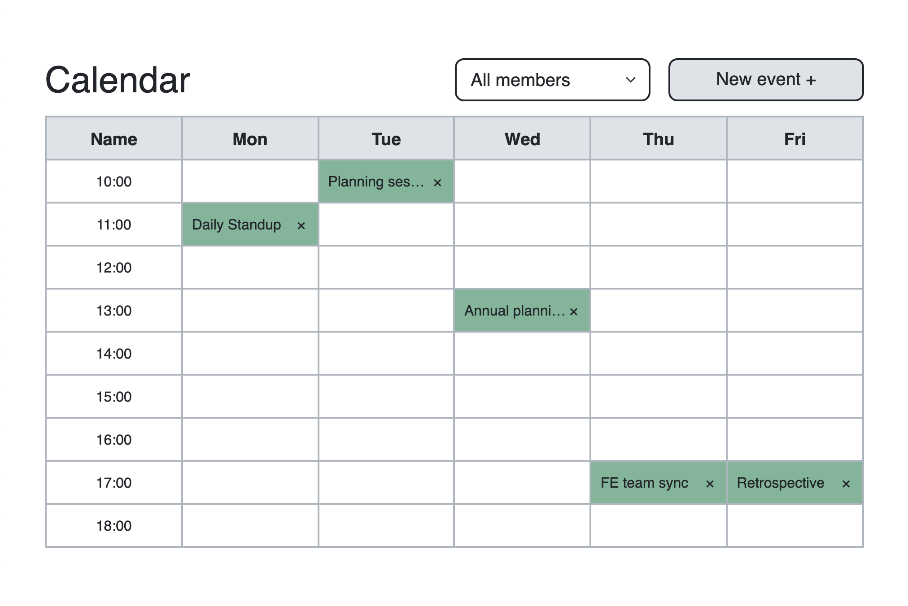

# Meeting planning calendar React

## Description

This is a simple app that shows schedule of meetings. You can add new one or remove existing meeting. Also you can filter meetings by participant.

## Preview (click to open project)

[](https://zzzhyrov.github.io/meeting-planning-calendar-react/)

## Tech stack

- React;
- SCSS;
- Bootstrap/React-Bootstrap;
- ESLint/Prettier

## Completed by

> **Yevhenii Zhyrov**

> - [ GitHub](https://github.com/zzzhyrov)
> - [ Linkedin](https://www.linkedin.com/in/zhyrov/)

## To start project in development mode:

```sh
$ npm install             // install the dependencies
$ npm run start           // launch 'DevServer'
```

## To build project:

```sh
$ npm run build           // generate a 'production' build
```

## To deploy project to GitHub Pages

```sh
$ npm run build           // generate a 'production' build
$ npm run deploy          // deploy it to 'GitHub Pages'
```

````
## To launch eslint

```sh
$ npm run lint            // start analizing *.{js} code and searching issues over all app
$ npm run lint:fix        // start fixing as many issues as possible over all app
$ npm run stylelint       // start analizing *.{css,scss} code and searching issues over all app
$ npm run stylelint:fix   // start fixing in css/scss as many issues as possible over all app
````
